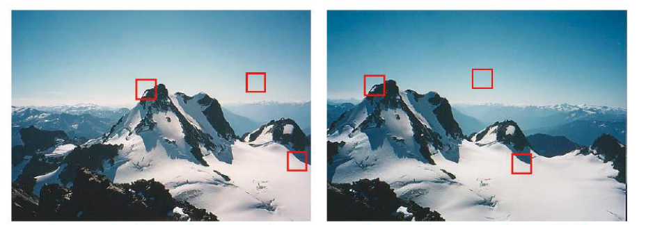

# ula 4 - Detecção e Casamento de Pontos Salientes

**Detecção e Casamento de Pontos Salientes**

## Corners

- Vimos que as arestas fornecem muitas informações sobre uma cena.
- Os **cantos (corners)** também podem ter muitas informações em um formato de representação muito compacto

## Como detectar corners?

- Regiões de cantos (**corners**) possuem uma grande mudança na aparência do patch
- Regiões de linhas (**edges**) possuem uma mudança apenas na direção perpendicular a linha
- Regiões planas (**flats**) possuem uma pequena mudança na aparência

### **Algoritmo dumb e simples para detecção de corners**

Para cada pixel

1. Obtenha um patch de imagem $𝑃_1(𝑥, 𝑦)$ de uma janela com largura $W$ e altura $H$
centrado no pixel;
2. Transladar a janela por uma pequena quantidade, obtendo um novo patch $𝑃_2(𝑥 +
Δ𝑥, 𝑦 + Δ𝑦)$;
3. Repita o paço 2 fazendo muitas translações diferentes $Δ𝑢_𝑖 = (Δ𝑥_𝑖, Δ𝑦_𝑖)$, obtendo um
conjunto de patches respectivos $𝑃_1, 𝑃_2, … , 𝑃_𝑛$;
4. Compare o patch 𝑃1 com todos os outros patches usando a diferença
 $E = \sum\limits_{i=2}^{n}||P_1-P_i||^2$
5. Se o pixel tiver um valor E grande, rotule-o como um canto (corner)

### Matriz de Correlação

- Pela expansão da Série de Taylor

$𝐼 (𝑥 + u, 𝑦 + v) \approx 𝐼 (𝑥, 𝑦) +u\dfrac{ \partial I }{\partial x}+v\dfrac{ \partial I}{\partial y}$

- Daí,

- 𝑢 e 𝜈 são variáveis. Portanto, M fornece todas as informações que precisamos sobre
a vizinhança do pixel
- M é conhecido como matriz de auto correlação.
- Observe que 𝐼𝑥 e 𝐼𝑦, usados para definir M, são as derivadas de imagem nas direções x
e y .

## Auto valores e Auto vetores

- Uma matriz quadrada pode ser considerada como uma transformação linear

- Uma dica sobre o comportamento de M é dada por seus **auto valores** e **auto vetores**.
- O número de **auto valores** e **auto vetores** é igual ao número de linhas (ou colunas) da matriz.

- Para a matriz de correlação, os auto valores indicam a rapidez com que o patch muda
quando a respectiva janela é transladada por pequenas quantidades:

Grande mudança em todos
direções. Ambos
auto valores de M são
grandes

Grande mudança em apenas uma direção. Um
autovalor é grande enquanto o outro é pequeno

Pequenas mudanças ao longo de todas as direções. Ambos auto valores são pequenos

- Podemos usar os auto valores de M para classificar pixels como cantos
- Uma abordagem comum é combinar os auto valores em um valor único R

## Detecção de Cantos de Harris

- Harris e Stephens propuseram a seguinte métrica:

$𝑅 = \lambda_1\lambda_2 − \alpha (\lambda_1 + \lambda_2)^2 = \det 𝑀 − \alpha \text{trace } 𝑀^2$

- A principal motivação sobre esta definição é que você realmente não precisa
calcule os auto valores. Você apenas calcula o determinante e o traço.
- Eles recomendam 𝛼 = 0,06

- Após calcular R para todos os pixels, obtemos uma nova imagem contendo um “**cornerness**” medido para os pixels.
- Pontos que são picos de intensidade e possuem grandes valores de **cornerness** correspondem a bons corners.
- É comum encontrar muitos **corners** próximos uns dos outros, que em muitos
aplicativos não é muito útil. Para aliviar isso pode-se usar um filtro máximo
com raio r, que define a distância mínima entre os pontos detectados.
- No openCV, a função **goodFeaturesToTrack** usa essa metodologia para
identificar recursos informativos na imagem

- Também é útil ponderar (pesos) a comparação de patches para que os pixels próximos ao centro sejam mais importantes do que pixels perto da borda:

$E_{a,b}(u, v) =\sum_{𝑥,𝑦}w(x, y)[𝐼 (𝑥 + 𝑢, 𝑦 + v) − I(x, y)]^2$

- A respectiva matriz de auto correlação torna-se:

- Por exemplo, $𝑤(𝑥, 𝑦)$ pode ser uma janela gaussiana

### Algoritmo

1. Calcule as derivadas horizontal, 𝐼𝑥, e vertical, 𝐼𝑦, da imagem por convolução da imagem original com derivadas de Gaussianas;
2. Calcule as três imagens correspondentes aos produtos 𝐼𝑥𝐼𝑥, 𝐼𝑥𝐼𝑦 e 𝐼𝑦𝐼𝑦;
3. Convolva cada uma dessas imagens com uma gaussiana maior;
4. Calcular a matriz M para cada pixel e a respectiva medida de “cornerness” R;
5. Encontre máximos locais acima de um determinado limite e relate-os como recurso detectado por localizações de pontos;
6. (opcional) Use um filtro máximo com raio r para manter apenas os máximos locais separados
pela distância r.

### Exemplo

### Propriedades

- Invariante a rotações

- Invariante a translação

- Não é invariante a escala

## Pontos Salientes

- Pontos salientes em uma imagem devem fornecer informações úteis e compactas.
- Idealmente, eles devem ser invariáveis a transformações geométricas, mudanças de brilho e ruído

- Por que detectar pontos salientes?
    - Classificação de imagem
    - Correspondência de imagem
    - Alinhamento de imagem
    - Rastreamento de objetos em filmes
    - E muitas outras aplicações

## Pirâmides de Imagens

- Tornando a detecção de features invariável a escala
- Pirâmides de imagens é uma **maneira de analisar facilmente uma imagem em muitas escalas diferentes**.
- Construímos uma pirâmide da imagem. A base da pirâmide é a imagem original.
- Cada nível é uma fração da altura e largura do nível abaixo dele.

**Exemplo:**

**Como diminuir o tamanho da imagem?**

- A abordagem mais simples é eliminar algumas linhas e colunas.
- O problema com esta abordagem é que a imagem com uma fração do tamanho do
original também terá uma fração da resolução de amostragem, o que leva ao **aliasing**
e outros problemas.
- Técnica chamada de **downsampling**

- A solução é suavizar a imagem antes de reduzir a resolução.
- Lembre-se de que a suavização elimina grandes frequências.
- Uma abordagem muito comum é **aplicar a suavização gaussiana** com um padrão
desvio de 1 ou 2 pixels. Neste caso, obtemos uma **pirâmide gaussiana**

**Exemplo:**

## Pirâmides de Imagem Gaussiana

- No caso das pirâmides gaussianas, é muito comum reduzir o tamanho da imagem em
metade em cada nível
- O seguinte filtro é usado para suavizar a imagem antes de reduzir a resolução:

## Pirâmides Laplacianas

- Pirâmides gaussianas geralmente são implementadas em conjunto com as pirâmides Laplacianas
- Pirâmides Laplacianas são formadas armazenando a diferença entre a imagem upsampled
do nível i de uma pirâmide gaussiana e a imagem do nível i+1

- Observe que a cena original é exatamente recuperada do downsample e
imagens de diferença!

- O termo “laplaciano” é um equívoco. O Laplaciano envolve segunda ordem
derivadas, que não é o que estamos calculando.

- Ter a imagem no topo da pirâmide gaussiana e as imagens da Pirâmide Laplaciana, podemos reconstruir exatamente a imagem original.
- A pirâmide Laplaciana é muito fácil de comprimir, pois a maioria dos pixels são zero ou próximos para zero.
- **Aplicação: Blending de imagens**

## SIFT - Scale invariant Feature Transform

- O algoritmo SIFT foi proposto por David Lowe em 2004
- O algoritmo SIFT representou uma mudança de paradigma na detecção de pontos salientes
e descrição. Muitos outros métodos usando conceitos do SIFT foram definidos na literatura
- Os pontos salientes detectados pelo método são muito robustos à tradução, rotação, escala e até transformações afins.

### Laplaciano da Gaussiana (LoG)

- Vimos que o Laplaciano de Gaussiano pode ser usado para detectar blobs;
- Blobs são pequenas regiões na imagem com intensidades muito diferente da região

### Aproximação do Laplaciano da Gaussiana (LoG)

- O Laplaciano da Gaussiano pode ser aproximado por uma diferença de gaussianos

### Scale invariant Feature Transform - SIFT

- O primeiro passo do algoritmo SIFT é construir um tipo particular de pirâmide Gaussiana
- A pirâmide é dividida em oitavas, e cada oitava também é dividida em diferentes
níveis

- Testes de Lowe mostraram que s = 3 fornece boa repetibilidade de keypoint
- Em cada oitava, encontramos os máximos no espaço e na escala

## Escala Máxima do Laplaciano da Gaussiana (LoG)

- Para ter invariância de escala, o algoritmo SIFT analisa a imagem em muitas escalas diferentes, e obter a resposta máxima entre um conjunto de escalas

### Localização precisa dos **keypoint**

- Lowe sugere o seguinte método para detecção máxima precisa:
- A imagem é aproximada no keypoint identificado usando uma Expansão de Taylor de segunda ordem

### **SIFT – Descrição dos Keypoints**

- Queremos comparar pontos-chave entre duas imagens
- Uma abordagem é comparar os patches em torno de cada ponto-chave
- Mas a comparação de patches é inútil se houver uma rotação ou uma escala
variação
- Portanto, precisamos definir propriedades associadas a cada keypoint, que também são invariáveis à translação, rotação e escala
- A descrição de um keypoint é baseada em gradientes

- A descrição de um ponto chave é baseada em gradientes, o ângulo de cada vetor gradiente é calculado e em seguida, um histograma dos ângulos é calculado
- O pico deste histograma está localizado. O respectivo ângulo define a referência de 
orientação dos keypoints
- A fim de aumentar a estabilidade da direção principal, duas abordagens são usados:
    - Os valores no histograma são ponderados pela magnitude do gradiente de cada pixel, uma vez que o ângulo para um vetor com pequena magnitude do gradiente tem pouco significado
    - Os valores também são ponderados pela distância de cada pixel do keypoint (pesos gaussianos são usados

- Para cada keypoint, temos a localização (posição do máximo na pirâmide de Laplaciano da Gaussiana ) a escala (desvio padrão usado no filtro Log) e orientação (pico do histograma de gradientes)
- Agora podemos definir o descritor!
- As coordenadas do patch ao redor do keypoint são definidas em relação ao
orientação principal
- Os ângulos dos gradientes também são normalizados pela orientação principal

- O patch é dividido em uma grade de 16 células, cada célula tem tamanho 4x4 pixels

- Para uma determinada célula, um histograma dos ângulos é calculado. O histograma tem 8 compartimentos e os valores são ponderados pela magnitude de cada gradiente

- O histograma geralmente é representado como 8 vetores, cada vetor representa um bin,
e o tamanho do vetor é o número de pixels com um gradiente com aquele
ângulo

- O descritor para uma dada célula são os 8 pesos associados a cada ângulo

- O descritor para um dado keypoint são os 8 pesos calculados para as 16 células,
totalizando 8*16=128 valores

- Os descritores ainda são influenciados por mudanças de contraste, uma vez que grandes contrastes levam para gradientes maiores
- Para adicionar invariância à mudança de iluminação, os vetores de recursos são normalizados para tem comprimento unitário

${f_i}^{\to}={f_i}^{\to}/||{f_i}^{\to}||$

- Lowe também considera que, às vezes, magnitudes de gradientes podem adquirir
valores e influenciar fortemente os resultados, então ele corta valores maiores que 0,2, e
renormaliza o vetor novamente

